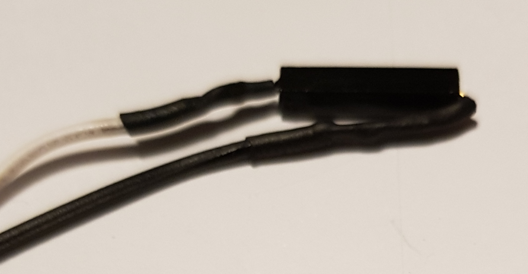
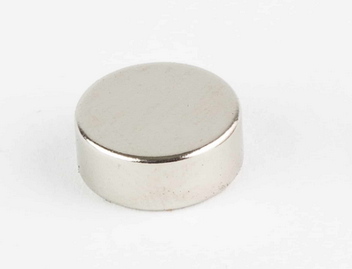

# serrure_medfan_01
Cet objet simule une serrure d'aspect magique qui s'ouvre et se ferme à l'aide d'un code qui doit être réalisé en activant des capteurs reed avec un aimant. Les capteurs sont cachés sous des glyphes illuminés par des leds RGB. Le code est enregistré en mémoire. De nombreux paramètres sont configurables via un back office accessible en wifi. La logique du code est assez simple est peut-être facilement trouvée par essais successifs. par exemple, avec 4 capteurs reed, il y a 4*3*2*1 combinaison possibles, soit seulement 24 combinaisons à essayer avant de trouver la bonne

Dans la configuration “usine”, la serrure fonctionne de la façon suivante. Il y a 4 glyphes composés de 4 capteurs magnétiques et 4 groupes de 2 leds. Pour ouvrir ou fermer la serrure, il faut trouver la bonne séquence d’activation pour chaque glyphe. Chaque glyphe doit être activé une seule fois et passant un aimant près du capteur magnétique

Si le glyphe est correct, il s’illume en jaune et il faut tenter de trouver le suivant. Si le glyphe n’est pas le bon, tous les glyphes déjà activés sont désactivés et il faut refaire la séquence depuis le début.

**[Exemples](#Exemples)**  
**[Composants](#Composants)**  
**[Branchements](#Branchements)**  
**[BackOffice](#BackOffice)**  

## Exemples
Voici deux exemples de casing plus avancé :
 - Le premier est tout simple, il utilise l’anneau de leds du kit technoLARP.
 - Le deuxième est plus abouti, il utilise 9 leds et 9 capteurs reed avec un boitier en bois mdf peint.

Dans les 2 cas, les leds se trouvent derrière un diffuseur de lumière (une matière blanche translucide) et d’un masque (matière opaque) qui permet de former un texte visible à l’oeil nu

## Composants
Vous aurez besoin pour monter la serrure medfan 01

|  | |
| :---------------- | :------: |
| Un kit technoLarp |  |
| Un câble micro-USB |  |
| Un ruban ou d’un anneau de led ws2812b ou neopixel |  |
| 4 capteurs magnétiques reed |  |
| Un aimant |  |
| Une batterie 18650 et son support |  |

## Branchements

1. Connecter le potentimètre sur le connecteur "POT" en rouge sur le schéma
1. Connecter les leds RGB sur le connecteur "NEOPIXEL" en orange sur le schéma

1. A côté du connecteur "NEOPIXEL", positionner le cavalier sur la position 3.3V ou 5V
    1. Si le kit sera alimenté par un câble USB, positionner le cavalier en 5V   
    1. Si le kit sera alimenté par la batterie, positionner le cavalier en 3.3V  

## Installation
Pour installer le firmware de l'objet, il faut suivre ce [tutorial](https://github.com/technolarp/technolarp.github.io/wiki/Installation-du-firmware)  

## BackOffice
Pour se connecter au back office de l'objet, il faut suivre ce [tutorial](https://github.com/technolarp/technolarp.github.io/wiki/Connexion-au-back-office-de-l'objet-via-le-wifi)  

## Paramètres de gameplay

| Nom         | Descriptif                                                                                                                         |
|---------------------|----------------------------------------------------------------------------------------------------------------------------------------------------------------------------------|
| **Object name**         | Le nom de l’objet, composé de 1 à 20 lettres et chiffres                                                                                                                         |
| **Object ID**           | Un numéro d’identification de l’objet                                                                                                                                            |
| **Group ID**            | Un numéro d’identification du groupe de l’objet                                                                                                                                  |
| **nbSegments**          | Le nombre de segments du panneau. Un segment est un groupe de 1 à 5 leds. Nombre entre 1 et 20.                                                                                  |
| **ledParSegment**       | Le nombre de leds groupées pour chaque segment du panneau. Entre 1 et 5                                                                                                          |
| **ActiveLeds**          | Le nombre total de leds utilisées par le panneau. Ce chiffre est calculé automatiquement (= nbColonnes X nbSegments). Il ne doit pas dépasser 25                                 |
| **Brightness**          | La luminosité des leds, entre 0 (éteinte) et 255 (pleine intensité)                                                                                                              |
| **Scintillement**       | Le scintillement permet d’activer le scintillement des leds pour un effet visuel plus ou moins rapide. le slider permet de régler la vitesse du scintillement                    |
| **couleurs fermée**     | Choix de la couleur quand la serrure est fermée                                                                                                                                  |
| **couleurs ouverte**    | Choix de la couleur quand la serrure est ouverte                                                                                                                                 |
| **couleurs transition** | Choix de la couleur qui indique si un glyphe a été activé                                                                                                                        |
| **Taille code**         | Le nombre de glyphe à activer pour ouvrir la serrure. entre 1 et nbSegments. Les boutons permettent de réinitialiser le code à 1-2-3-4… ou de mettre un code aléatoire           |
| **Code**                | la séquence qui permet de fermer ou ouvrir la serrure. Dans cet exemple, il faudra activer le capteur reed n°2, puis n°0, puis n°1 et enfin n°3 pour ouvrir ou fermer la serrure |
| **statut Panneau**      | le statut actuel de l’objet. Il peut être  OUVERTE FERMEE OUVERTURE Les 3 boutons permettent de forcer l’état de la serrure                                                      |
| **Timeout Reset**       | le délai après lequel les glyphes activés sont éteints automatiquement                                                                                                           |
| **Debounce Time**       | un paramètre à n pas modifier                                                                                                                                                    |

